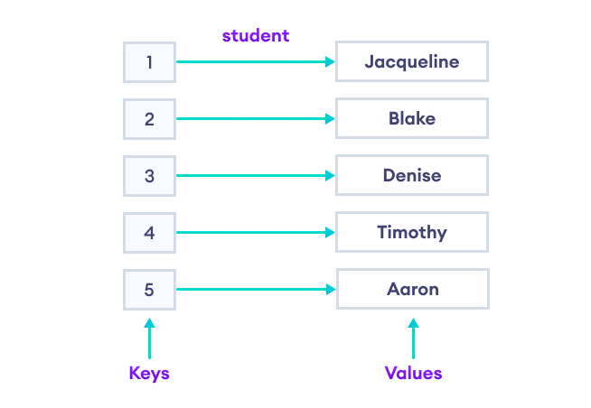

# Map em C++

# O que é um Map?

Em C++, o termo "map" refere-se a um contêiner associativo que armazena pares de chave-valor. É uma implementação da estrutura de dados de tabela hash ou árvore de busca binária equilibrada, que permite um acesso rápido aos elementos com base em sua chave.

---

Cada elemento no mapa consiste em uma chave única e seu respectivo valor associado. A chave é usada para acessar o valor correspondente de forma eficiente. A estrutura do mapa garante que as chaves sejam exclusivas e armazenadas em ordem crescente, o que facilita a pesquisa e a recuperação dos valores.

## 

---

# Para o quê serve um map?

- **Associação de valores às chaves:** O mapa permite associar valores a chaves de maneira eficiente. Isso é útil quando você precisa armazenar e recuperar informações com base em uma chave única. Por exemplo, você pode usar um mapa para armazenar nomes de pessoas (chave) e seus respectivos adjetivos (valor).

```
#include <iostream>
#include <string>
#include <map>

using namespace std;

// Criando um map de professores do algoritmo escola e relacionando a um adjetivo :)
int main()
{
    // Criando um mapa com chave do tipo string e valor do tipo string
    map<string, string> mapa;

    // Inserindo dados na estrutura
    mapa["Jarssin"] = "Brabissimo";
    mapa["Igor"] = "Fortin";
    mapa["Ezequiel"] = "Fofo";
    // Ou
    mapa.insert(make_pair("Tonhão", "Calvo"));

    // Criando um iterator apontado para o primeiro elemento do map
    map<string, string>::iterator it = mapa.begin();

    while (it != mapa.end())
    {
        cout << it->first << " é " << it->second << endl;
        ++it;
    }

    // Output
    // Ezequiel é Fofo
    // Igor é Fortin
    // Jarssin é Brabissimo
    // Tonhão é Calvo

    return 0;
}
```

---

- **Acesso rápido aos elementos:** O mapa é uma estrutura de dados otimizada para acesso rápido aos elementos com base em suas chaves. Ele usa técnicas como tabelas hash ou árvores de busca equilibradas para garantir que a pesquisa seja eficiente. Isso é particularmente útil quando você precisa recuperar informações rapidamente usando uma chave.

```cpp
#include <iostream>
#include <string>
#include <map>

using namespace std;

// Criando um map de professores do algoritmo escola e relacionando a um adjetivo :)
int main()
{
    // Criando um mapa com chave do tipo string e valor do tipo string
    map<string, string> mapa;

    // Inserindo dados na estrutura
    mapa["Jarssin"] = "Brabissimo";
    mapa["Igor"] = "Fortin";
    mapa["Ezequiel"] = "Fofo";
    // Ou
    mapa.insert(make_pair("Tonhão", "Calvo"));

    // Procurando o careca
    cout << mapa["Tonhão"] << endl;
    // Ou
    cout << mapa.find("Tonhão")->second << endl;
		// Output
    // Calvo
    // Calvo

    return 0;
}
```

---

- **Detecção de duplicatas:** Um mapa geralmente permite apenas uma ocorrência única de cada chave. Isso é útil para evitar duplicatas e garantir a integridade dos dados. Se você tentar inserir uma chave duplicada, o valor associado à chave será atualizado automaticamente.

```cpp
#include <iostream>
#include <string>
#include <map>

using namespace std;

// Criando um map de professores do algoritmo escola e relacionando a um adjetivo :)
int main()
{
    // Criando um mapa com chave do tipo string e valor do tipo string
    map<string, string> mapa;

    // Inserindo dados na estrutura
    mapa["Jarssin"] = "Brabissimo";
    mapa["Igor"] = "Fortin";
    mapa["Ezequiel"] = "Fofo";
    // Ou
    mapa.insert(make_pair("Tonhão", "Calvo"));

    // Inserindo em uma chave já existente
    mapa["Tonhão"] = "Nem tá tanto assim po";
    mapa["Tonhão"] = "Pior que tá ficando mesmo";

    for (auto elemento : mapa)
    {
        cout << elemento.first << ": " << elemento.second << endl;
    }

    // Output
    // Ezequiel: Fofo
    // Igor: Fortin
    // Jarssin: Brabissimo
    // Tonhão: Pior que tá ficando mesmo

    return 0;
}
```

---

- **Manutenção automática da ordem:** Dependendo da implementação do mapa, ele pode manter automaticamente as chaves em uma ordem específica. Por exemplo, o **`std::map`** na biblioteca padrão do C++ mantém as chaves em ordem crescente. Isso facilita a iteração em ordem ou a busca por faixas de valores.

Em resumo, o uso de um mapa é benéfico quando você precisa associar valores a chaves únicas e acessar rapidamente esses valores com base nas chaves. Ele fornece uma estrutura de dados conveniente, eficiente e flexível para manipulação de dados em muitos cenários de programação.

---

# Unordered Map

É uma implementação de mapa baseada em tabela de dispersão (hash table). Ela oferece um mapeamento eficiente de chaves para valores com um tempo médio constante (O(1)) para operações de busca, inserção e remoção.

```cpp
#include <iostream>
#include <string>
#include <unordered_map>

using namespace std;

// Criando um map desordenado de professores do algoritmo escola e relacionando a um adjetivo :)
int main()
{
    // Criando um mapa com chave do tipo string e valor do tipo string
    unordered_map<string, string> mapa;

    // Inserindo dados na estrutura
    mapa["Jarssin"] = "Brabissimo";
    mapa["Igor"] = "Fortin";
    mapa["Ezequiel"] = "Fofo";
    // Ou
    mapa.insert(make_pair("Tonhão", "Calvo"));

    // Criando um iterator apontado para o primeiro elemento do map
    unordered_map<string, string>::iterator it = mapa.begin();

    while (it != mapa.end())
    {
        cout << it->first << " é " << it->second << endl;
        ++it;
    }

    // Output
    // Tonhão é Calvo
    // Ezequiel é Fofo
    // Igor é Fortin
    // Jarssin é Brabissimo

    return 0;
}
```

---

# Questão BeeCrowd

[https://www.beecrowd.com.br/judge/pt/problems/view/1281](https://www.beecrowd.com.br/judge/pt/problems/view/1281)

---

# Continue seus estudos

- Notação de big O e complexidade, o por que do TLE?

[https://www.youtube.com/watch?v=5LQNW3XKJUA](https://www.youtube.com/watch?v=5LQNW3XKJUA)

Recomendação para quem sabe inglês:

[https://frontendmasters.com/courses/algorithms/](https://frontendmasters.com/courses/algorithms/)

---

# Boa sorteee e bons estudos!!


